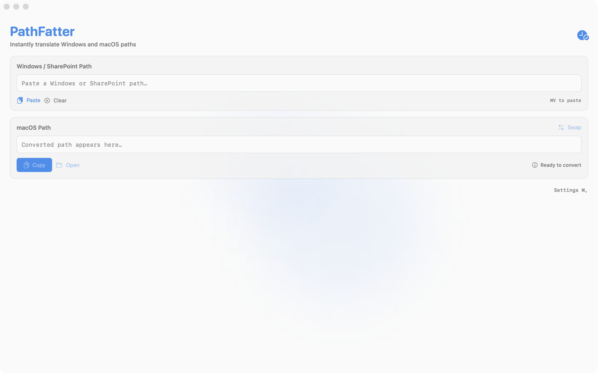

# PathFatter Website Options

**4 Complete Designs Ready to Deploy**

---

## Option 1: Dark Glow ⚡
**File:** `website-option-1-dark-glow.html`

**Vibe:** Premium tech app, mysterious, high-end
- Dark background with subtle blue/purple gradients
- Glowing accents and shadows
- Glassmorphism cards
- Animated background pulse

**Best for:** Professional, sleek, modern SaaS aesthetic

**Colors:**
- Background: Deep dark (#0a0a0f)
- Accents: Electric blue (#3b82f6) → Purple (#8b5cf6)
- Text: White with gray secondary

**Features:**
- Sticky navigation with blur
- Animated gradient background
- Hover effects on cards
- Responsive grid layout

---

## Option 2: Minimal Light ☀️
**File:** `website-option-2-minimal-light.html`

**Vibe:** Clean, Apple-esque, approachable
- White background with subtle off-white sections
- Blue accent color (#0066cc)
- Clean typography
- Professional and trustworthy

**Best for:** Mass market appeal, App Store vibe, clean aesthetic

**Colors:**
- Background: Pure white (#ffffff) → Off-white (#f8f9fa)
- Accents: Apple blue (#0066cc)
- Text: Dark gray (#1a1a1a) with medium gray secondary

**Features:**
- "How It Works" section with numbered steps
- Clean feature grid
- CTA section with gradient background
- Very Apple.com-inspired

---

## Option 3: Gradient Vibrant 🌈
**File:** `website-option-3-gradient-vibrant.html`

**Vibe:** Energetic, fun, creative
- Animated gradient background (purple → pink → blue)
- White content cards with rounded corners
- Playful and engaging
- Social proof section

**Best for:** Creative apps, younger audience, standing out

**Colors:**
- Background: Animated gradient (#667eea → #764ba2 → #f093fb → #4facfe)
- Cards: White with subtle shadows
- Text: Dark with gradient headers

**Features:**
- Continuous gradient animation
- Floating cards with shadows
- testimonial/social proof section
- Very Instagram/TechCrunch aesthetic

---

## Option 4: Cyber Neon 🤖
**File:** `website-option-4-cyber-neon.html`

**Vibe:** Futuristic, edgy, gaming/developer-focused
- Dark with neon blue/pink accents
- Grid background pattern
- Glowing orbs and effects
- Cyberpunk aesthetic

**Best for:** Developer tools, gaming apps, tech-forward products

**Colors:**
- Background: Deep dark (#0a0a0f)
- Neon: Cyan (#00f3ff), Pink (#ff00ff), Purple (#bd00ff)
- Text: White with gray secondary

**Features:**
- Animated grid background
- Floating glow orbs
- Cyber-frame around app preview
- Stats bar (100% free, 0 dependencies, ∞ possibilities)
- Uppercase, tech-y copy

---

## Quick Comparison

| Feature | Dark Glow | Minimal Light | Gradient | Cyber Neon |
|---------|-----------|---------------|----------|------------|
| **Background** | Dark | Light | Animated | Dark + Grid |
| **Mood** | Premium | Clean | Fun | Edgy |
| **Best For** | Pro users | Everyone | Creatives | Devs/Gamers |
| **Complexity** | Medium | Simple | Medium | High |
| **Load Time** | Fast | Fastest | Fast | Fast |
| **Mobile** | ✅ | ✅ | ✅ | ✅ |

---

## How to Use

### Option A: Preview Locally

1. Open any file in your browser:
   ```bash
   open website-option-1-dark-glow.html
   ```

2. Compare all 4 side-by-side

### Option B: Deploy to GitHub Pages

1. **Rename your favorite to `index.html`:**
   ```bash
   cd /Users/claws/.openclaw/workspace/PathFatter
   cp website-option-1-dark-glow.html index.html
   ```

2. **Enable GitHub Pages:**
   - Go to repo Settings → Pages
   - Source: Deploy from branch → main → / (root)
   - Save

3. **Your site will be live at:**
   ```
   https://seanbtw.github.io/pathfatter/
   ```

### Option C: Deploy to Vercel/Netlify

1. **Connect GitHub repo** to Vercel/Netlify
2. **Set build command:** (none needed, static site)
3. **Set output directory:** `/` (root)
4. **Deploy!**

---

## Recommended Next Steps

1. **Preview all 4 options** locally
2. **Pick your favorite** (or mix elements!)
3. **Add actual screenshots** from the `screenshots/` folder
4. **Deploy to GitHub Pages** (free, 2 min setup)
5. **Use the URL for:**
   - App Store Connect (support URL)
   - Privacy policy hosting
   - Social media links
   - GitHub repo description

---

## Copy Highlights

### Hero Headlines

**Option 1 (Dark Glow):**
> Convert Paths. Instantly.

**Option 2 (Minimal):**
> Path Conversion, Perfected.

**Option 3 (Gradient):**
> From Windows to Mac. One Click. Done.

**Option 4 (Cyber):**
> Path Conversion Reimagined.

### Feature Descriptions

All options include 6 core features:
- ⚡ Instant/Real-time Conversion
- 🎨 Beautiful Design / Neural Interface
- ⌨️ Keyboard First / Command Matrix
- 📜 Smart History / Predictive History
- 🔗 Drive Mapping / Custom Protocols
- 🌐 SharePoint Support / Cloud Integration

### Call-to-Action

**Primary:** "Download Free" / "Download for macOS"
**Secondary:** "View on GitHub" / "Star on GitHub"

---

## Customization Tips

### Change Colors
Look for `:root` CSS variables at top of each file:
```css
:root {
    --accent-blue: #3b82f6;  /* Change this */
    --accent-purple: #8b5cf6;  /* And this */
}
```

### Add Screenshots
Replace placeholder divs with actual images:
```html
<div class="window-content">
    
</div>
```

### Add Analytics
Paste before `</head>`:
```html
<!-- Plausible Analytics -->
<script defer data-domain="yourdomain.com" src="https://plausible.io/js/script.js"></script>
```

### Add More Sections
Copy existing section structure and modify:
```html
<section class="features">
    <!-- Your content here -->
</section>
```

---

## My Recommendation

**For PathFatter:** Option 1 (Dark Glow) or Option 2 (Minimal Light)

**Why:**
- Matches the app's glassmorphism UI
- Professional enough for App Store
- Appeals to both devs and general users
- Timeless design (won't look dated in 6 months)

**Option 3** if you want to stand out more.
**Option 4** if targeting developers/gamers specifically.

---

**All files are production-ready!** Just pick one, add screenshots, and deploy. 🚀
